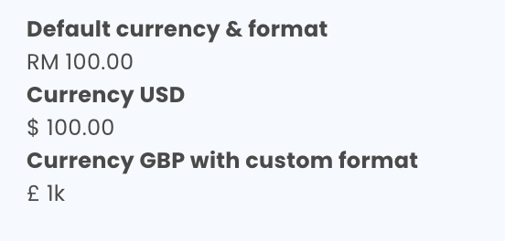

# Your Component Name

Short description of this component

---

## Props

```ts
{
  // class name
  className?: string;
  // custom style props
  style?: HTMLSpanElement['style'];
  // amount
  amount: number;
  // price format, default to "0,0.00"
  format?: string;
  // currency of price, default to "MYR"
  currency?: string;
  // whether show currency symbol, default to true, if falsy show "MYR" instead of "RM"
  enableSymbol?: boolean;
  // prefix for price
  prefix?: ReactNode;
  // postfix for price
  postfix?: ReactNode;
  // only text will be return, this will ignored className props
  onlyText?: boolean;
}
```

---

## Preview



---

## Example

```ts
// import from package
import { Money } from "@stack/components";

// default currency & format
<Money amount={100} />

// Currency USD
<Money amount={100} currency="USD" />

// Currency GBP with custom format
// format can refer to this link http://numeraljs.com/#format
<Money amount={100} currency="USD" format="0a" />
```
